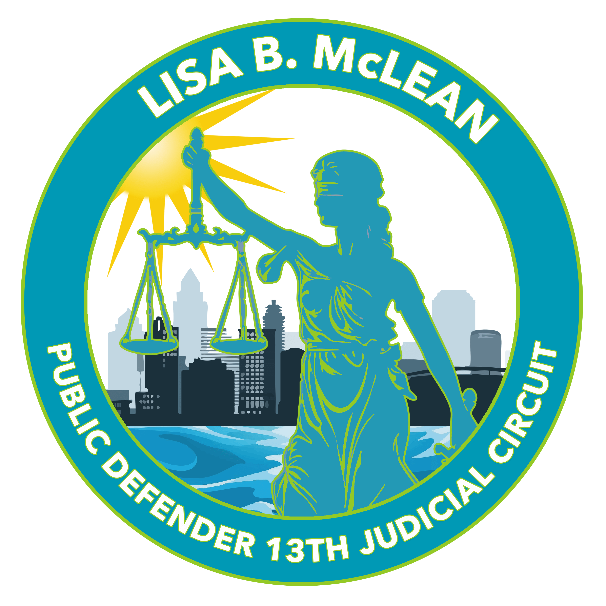

# Deploy Logo and Icon Fixes to Server

## What We Fixed
✅ **Logo Path**: Changed from `Lisa-Circular-PD-Logo-1-MIN.png` to `src/Lisa-Circular-PD-Logo-1-MIN.png`
✅ **Font Awesome Icons**: Added Font Awesome CSS and replaced all emoji icons with professional font icons
✅ **Windows Server 2008 R2 Compatibility**: All icons will now display properly

## Commands to Run on Server (10.172.1.63)

### Step 1: Backup Current File
```cmd
cd C:\pd13eventcal\src
copy pd13eventcal.html pd13eventcal.html.backup
```

### Step 2: Replace HTML File
You need to replace the current HTML file with the fixed version. Choose one method:

**Method A: Copy from Network Share (Recommended)**
```cmd
cd C:\pd13eventcal\src
copy "W:\Ecal\src\pd13eventcal.html" pd13eventcal.html
```

**Method B: Manual Download**
1. Download the fixed file from your development environment
2. Copy it to `C:\pd13eventcal\src\pd13eventcal.html`

### Step 3: Restart Server
```cmd
cd C:\pd13eventcal
restart-server.bat
```

### Step 4: Test the Fixes
1. Open browser: http://10.172.1.63:3000
2. **Check Logo**: PD13 logo should now appear in the header
3. **Check Icons**: Admin panel buttons should show proper icons:
   - ➕ → ✓ Plus icon
   - 📋 → ✓ List icon  
   - 🏷️ → ✓ Tags icon
   - 📁 → ✓ Folder icon

## What Changed

### 1. Added Font Awesome CSS (Line 7)
```html
<link rel="stylesheet" href="https://cdnjs.cloudflare.com/ajax/libs/font-awesome/4.7.0/css/font-awesome.min.css">
```

### 2. Fixed Logo Path (Line 887)
```html
<!-- BEFORE -->


<!-- AFTER -->

```

### 3. Replaced Emoji Icons with Font Awesome
```html
<!-- BEFORE -->
<button class="btn btn-success" onclick="openEventModal()">➕ Create New Event</button>

<!-- AFTER -->
<button class="btn btn-success" onclick="openEventModal()"><i class="fa fa-plus"></i> Create New Event</button>
```

## Benefits
- ✅ Logo will display correctly
- ✅ Professional-looking icons that work on Windows Server 2008 R2
- ✅ No more squares or question marks
- ✅ Consistent icon appearance across all browsers
- ✅ Uses CDN for Font Awesome (reliable and fast)

## Troubleshooting

**If logo still doesn't show:**
- Verify the logo file exists at: `C:\pd13eventcal\src\Lisa-Circular-PD-Logo-1-MIN.png`
- Check file permissions

**If icons don't load:**
- Ensure server has internet access to load Font Awesome from CDN
- Check browser console for any errors

**If changes don't appear:**
- Clear browser cache (Ctrl+F5)
- Verify the HTML file was updated correctly
- Restart the server again

## Success Indicators
✅ PD13 logo appears in header  
✅ Admin panel shows: ➕📋🏷️📁 as proper icons  
✅ No squares or question marks  
✅ All functionality works as before  

The calendar is now fully functional with proper logo and icons on Windows Server 2008 R2!