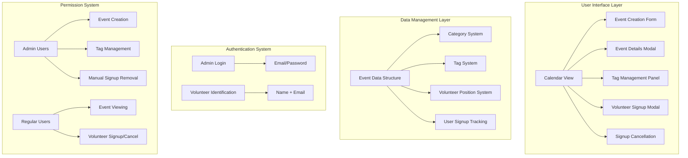
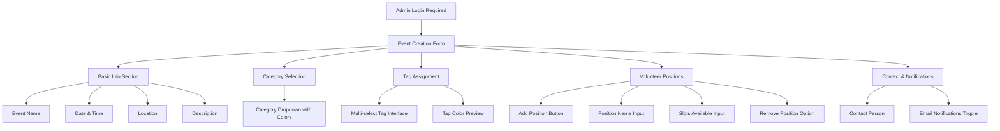
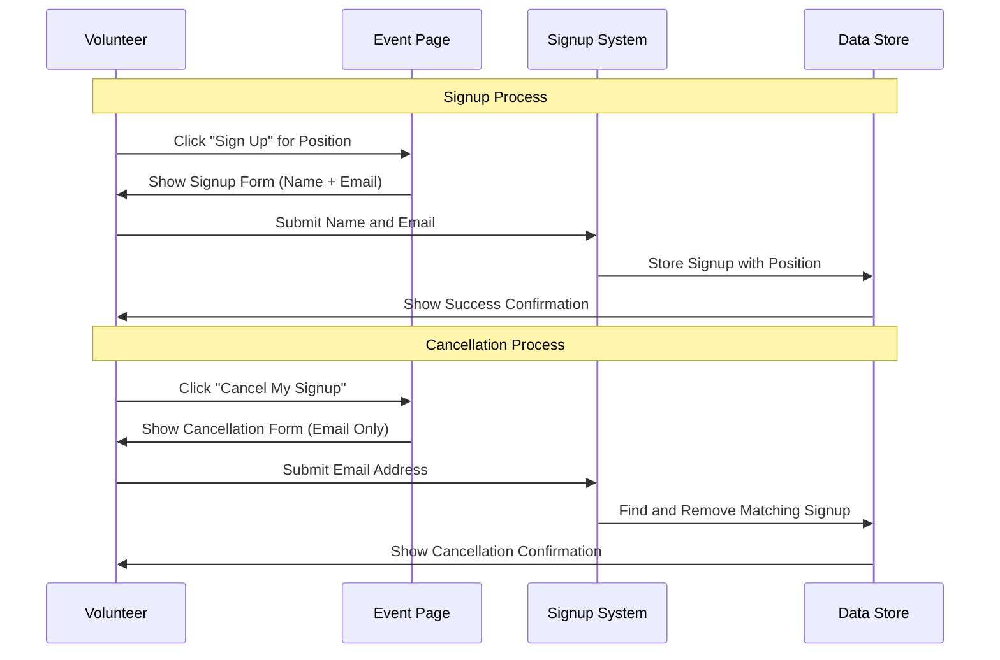

# Enhanced Event Calendar Architecture Plan

## Executive Summary

This architecture enhances the existing HTML-based event calendar system for internal government office use, focusing on volunteer opportunity management with improved categorization, tag management, and role-based signup functionality while maintaining the current simplicity and local file approach.

## System Overview



## 1. Authentication & Access Control

### Admin Access (Event Creators)
- **Simple Email/Password Login**: Predefined admin credentials stored locally
- **Admin Capabilities**:
  - Create and edit events
  - Manage tags (create, edit, delete)
  - View all signups across events
  - Manually remove volunteer signups
  - Generate email notifications

```javascript
const adminUsers = {
    "manager@cityoffice.gov": {
        password: "admin123", // In production, use hashed passwords
        name: "Community Engagement Manager",
        role: "admin"
    },
    "assistant@cityoffice.gov": {
        password: "staff456",
        name: "Program Assistant", 
        role: "admin"
    }
}
```

### Volunteer Access (No Login Required)
- **Signup Process**: Enter name and email address
- **Cancellation Process**: Enter email address only to cancel signup
- **View Access**: Anyone can view events and available volunteer positions

## 2. Enhanced Data Structure Design

### Event Data Model
```javascript
const eventSchema = {
    id: "unique_identifier",
    title: "string",
    date: "YYYY-MM-DD",
    time: "HH:MM",
    location: "string",
    contactPerson: "string",
    description: "string",
    category: "category_id", // Links to predefined categories
    tags: ["tag_id_1", "tag_id_2"], // Array of tag references
    volunteerPositions: [
        {
            id: "position_id",
            name: "Registration Helper",
            slotsAvailable: 5,
            signups: [
                {
                    id: "signup_id",
                    name: "John Smith",
                    email: "john.smith@cityoffice.gov",
                    signupTimestamp: "timestamp"
                }
            ]
        }
    ],
    emailNotifications: boolean,
    createdBy: "admin_email",
    createdAt: "timestamp",
    lastModified: "timestamp"
}
```

### Category System (Predefined)
```javascript
const predefinedCategories = [
    {
        id: "community_celebrations",
        name: "Community Events & Celebrations",
        color: "#FF6B6B",
        description: "Parades, festivals, holiday events, toy drives"
    },
    {
        id: "service_volunteer",
        name: "Service & Volunteer Opportunities", 
        color: "#4ECDC4",
        description: "Paint Your Heart Out Tampa, Trinity Cafe, food drives"
    },
    {
        id: "educational_awareness",
        name: "Educational & Awareness Events",
        color: "#45B7D1",
        description: "Speaking engagements, wellness fairs, voter registration"
    },
    {
        id: "civic_engagement",
        name: "Civic Engagement",
        color: "#96CEB4",
        description: "City council meetings, town halls"
    },
    {
        id: "office_sponsored",
        name: "Office-Sponsored Events",
        color: "#FFEAA7",
        description: "Swearing-in ceremonies, intern recognition, bingo days"
    }
]
```

### Tag Management System (Admin-Only Control)
```javascript
const tagSchema = {
    id: "tag_id",
    name: "Volunteer Opportunity",
    color: "#9B59B6", // Hex color for visual distinction
    description: "Events requiring volunteer participation",
    createdBy: "admin_email",
    createdAt: "timestamp",
    isActive: true
}

const commonTags = [
    { name: "Volunteer Opportunity", color: "#9B59B6" },
    { name: "Family Friendly", color: "#E74C3C" },
    { name: "Weekend Event", color: "#F39C12" },
    { name: "Evening Event", color: "#8E44AD" },
    { name: "Outdoor Activity", color: "#27AE60" },
    { name: "Training Required", color: "#E67E22" },
    { name: "Physical Activity", color: "#3498DB" },
    { name: "Food Service", color: "#1ABC9C" }
]
```

## 3. User Interface Enhancements

### Enhanced Event Creation Form


### Tag Management Interface (Admin Only)
- **Tag Creation Panel**: Form to create new tags with name, color picker, and description
- **Tag List View**: Sortable table showing all tags with edit/delete options
- **Tag Usage Analytics**: Show which tags are most commonly used
- **Color Coordination**: Visual color picker ensuring good contrast and accessibility

### Enhanced Event Details Modal
- **Event Header**: Title and category badge with color
- **Event Information**: Date, time, location, contact person, description
- **Tags Display**: Colored tag badges for visual identification
- **Volunteer Positions Section**: Individual position cards showing available/filled slots
- **Action Buttons**: 
  - For volunteers: Position-specific signup buttons
  - For admins: View all signups, manual signup removal, email generation

### Volunteer Signup & Cancellation Flow


## 4. Volunteer Position Management

### Position-Specific Features
- **Dynamic Position Addition**: Admins can add/remove positions during event creation
- **Slot Tracking**: Real-time tracking of available vs. filled positions
- **Position-Specific Signups**: Users select specific roles when volunteering
- **Overflow Handling**: Clear messaging when positions are full

### Signup Management
- **Volunteer Signup**: Name + email required for all signups
- **Self-Service Cancellation**: Volunteers enter email to cancel their own signup
- **Admin Override**: Event creators can manually remove any signup
- **Duplicate Prevention**: System prevents multiple signups with same email per position

## 5. Email Integration (Maintaining Current Approach)

### Email Generation Features
- **Event Creation Emails**: Generate mailto links with event details for promotion
- **Signup Notifications**: Optional email notifications to event creators when someone signs up
- **Event Reminders**: Generate email templates for event reminders

### Email Templates
```javascript
const emailTemplates = {
    eventCreation: {
        subject: "New Volunteer Opportunity: {eventTitle}",
        body: `Event Details:
               Title: {eventTitle}
               Date: {eventDate}
               Time: {eventTime}
               Location: {eventLocation}
               Category: {categoryName}
               
               Volunteer Positions Available:
               {positionsList}
               
               Contact: {contactPerson}
               
               Please check the internal calendar to sign up.`
    },
    
    signupNotification: {
        subject: "New Volunteer Signup: {eventTitle}",
        body: `New volunteer signup for {eventTitle}:
               
               Volunteer: {userName} ({userEmail})
               Position: {positionName}
               Signup Time: {timestamp}
               
               Current Status:
               {positionName}: {filledSlots}/{totalSlots} filled
               
               View all signups in the event calendar.`
    }
}
```

## 6. Technical Implementation Specifications

### Data Persistence Strategy (Local Storage)
```javascript
const dataStorage = {
    events: "localStorage key: 'pd13_events'",
    categories: "localStorage key: 'pd13_categories'", 
    tags: "localStorage key: 'pd13_tags'",
    adminUsers: "localStorage key: 'pd13_admins'",
    currentSession: "sessionStorage key: 'pd13_session'"
}
```

### Authentication Implementation
```javascript
// Simple local authentication
function authenticateAdmin(email, password) {
    const admins = JSON.parse(localStorage.getItem('pd13_admins') || '{}');
    const admin = admins[email];
    
    if (admin && admin.password === password) {
        sessionStorage.setItem('pd13_session', JSON.stringify({
            email: email,
            name: admin.name,
            role: admin.role,
            loginTime: new Date().toISOString()
        }));
        return true;
    }
    return false;
}

// Check if user is authenticated admin
function isAuthenticated() {
    const session = sessionStorage.getItem('pd13_session');
    return session !== null;
}
```

### Signup Management Functions
```javascript
// Add volunteer signup
function addVolunteerSignup(eventId, positionId, name, email) {
    const events = getEvents();
    const event = events.find(e => e.id === eventId);
    const position = event.volunteerPositions.find(p => p.id === positionId);
    
    // Check for duplicate email in this position
    const existingSignup = position.signups.find(s => s.email === email);
    if (existingSignup) {
        throw new Error('Email already signed up for this position');
    }
    
    // Check if position is full
    if (position.signups.length >= position.slotsAvailable) {
        throw new Error('Position is full');
    }
    
    // Add signup
    position.signups.push({
        id: generateId(),
        name: name,
        email: email,
        signupTimestamp: new Date().toISOString()
    });
    
    saveEvents(events);
    
    // Send notification if enabled
    if (event.emailNotifications) {
        generateSignupNotificationEmail(event, position, name, email);
    }
}

// Cancel volunteer signup
function cancelVolunteerSignup(eventId, positionId, email) {
    const events = getEvents();
    const event = events.find(e => e.id === eventId);
    const position = event.volunteerPositions.find(p => p.id === positionId);
    
    const signupIndex = position.signups.findIndex(s => s.email === email);
    if (signupIndex === -1) {
        throw new Error('No signup found with that email');
    }
    
    position.signups.splice(signupIndex, 1);
    saveEvents(events);
}
```

## 7. Migration Strategy

### Phase 1: Core Infrastructure (Week 1-2)
1. Implement admin authentication system
2. Add enhanced data structures for categories and tags
3. Create tag management interface for admins
4. Update event creation form with category and tag selection

### Phase 2: Volunteer Position System (Week 3-4)
1. Add volunteer position management to event creation
2. Implement position-specific signup forms
3. Add volunteer cancellation functionality
4. Update event details modal with position displays

### Phase 3: Enhanced Features (Week 5-6)
1. Implement email notification enhancements
2. Add admin tools for manual signup management
3. Create improved calendar display with categories and tags
4. Add search and filtering capabilities

### Phase 4: Polish & Testing (Week 7-8)
1. Comprehensive testing of all features
2. User interface refinements
3. Documentation and training materials
4. Data migration from current system

## 8. Security & Data Protection

### Local Security Measures
- **Password Storage**: Use simple hashing for admin passwords
- **Session Management**: Secure session storage with timeouts
- **Input Validation**: Comprehensive form validation and sanitization
- **Data Backup**: Regular localStorage export functionality

### Privacy Protection
- **Minimal Data Collection**: Only collect necessary volunteer information
- **Email Privacy**: Email addresses only used for signup management
- **Data Retention**: Configurable cleanup of old event data
- **Access Control**: Clear separation between admin and volunteer access

## 9. User Experience Enhancements

### For Event Creators (Admins)
- **Streamlined Event Creation**: Intuitive form with category and tag selection
- **Comprehensive Signup Management**: View all signups with manual removal options
- **Tag Management**: Easy creation and organization of event tags
- **Email Integration**: Seamless email generation for event promotion

### For Volunteers (Staff)
- **Easy Signup Process**: Simple name and email entry for position-specific signup
- **Self-Service Cancellation**: Cancel signups using just email address
- **Clear Event Information**: Enhanced event details with categories and tags
- **Position Clarity**: Clear display of available volunteer positions and requirements

## 10. Success Metrics

### Operational Metrics
- **Event Creation Efficiency**: Time to create and publish new events
- **Volunteer Participation**: Signup rates and position fill rates
- **Administrative Overhead**: Time spent managing signups and communications
- **User Satisfaction**: Feedback from both event creators and volunteers

### Technical Metrics
- **System Reliability**: Uptime and data integrity
- **Performance**: Page load times and responsiveness
- **Data Accuracy**: Signup tracking and reporting accuracy
- **Maintenance Requirements**: Time needed for system updates and maintenance

This architecture provides a comprehensive enhancement to your existing system while maintaining its simplicity and effectiveness for government office volunteer coordination. The design focuses on practical usability for staff members while providing robust administrative controls for the community engagement manager.